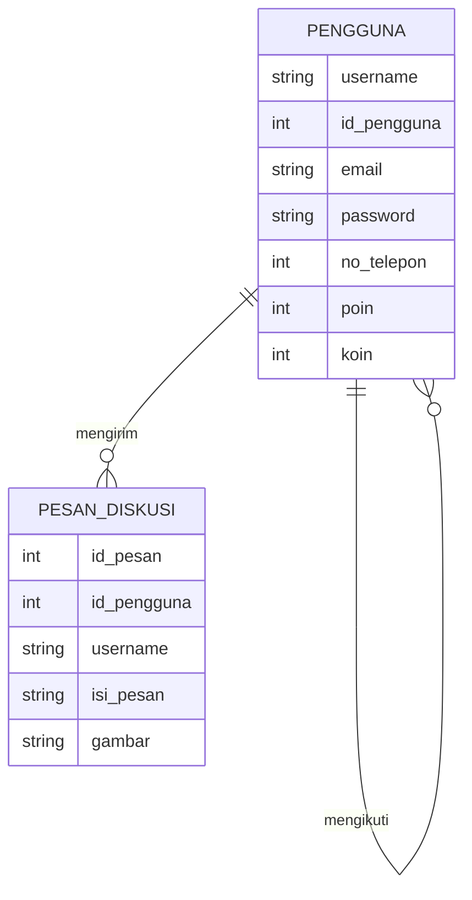
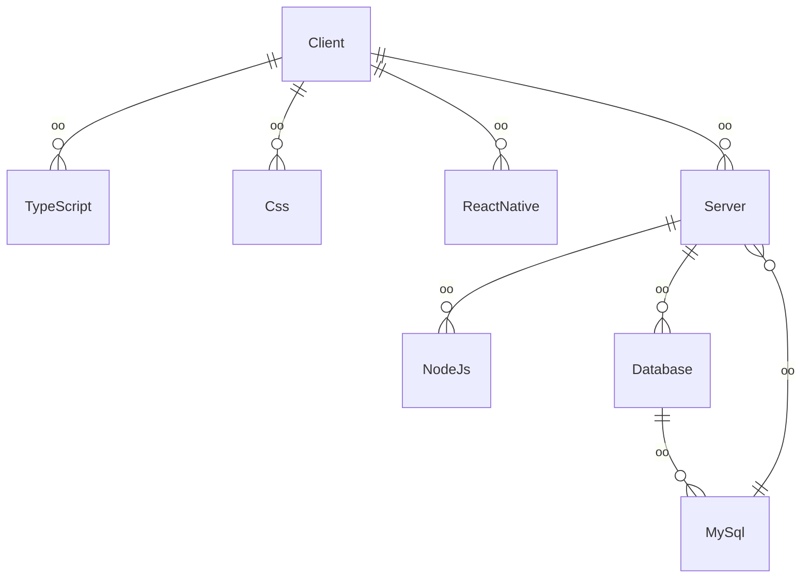

## 1.1 Latar Belakang

  Terkadang kita kesulitan menemukan materi koding yang kita inginkan atau ketika kita menenemukan materi namun dengan bahasa yang tidak kita pahami.

## 1.2. Deksripsi Teknologi Informasi
  ZapKode adalah aplikasi mobile berbasis client-server yang mengusung tema edukasi mengenai dunia IT, yang dimana IT sedang berkembang dengan sangat pesat. Berarti, kedepannya akan banyak lagi orang yang menekuni Teknologi Informasi. KodIndo akan membantu kita untuk menjelajahi dunia IT, mulai dari bagaimana kita akan memulai, darimana kita akan memulai, dan apa saja yang akan kita pelajari.

## 1.3. Branding

## 2. User Story

Pengguna bisa | Tingkat penting
---|---
Mengirim pesan diskusi | ⭐⭐⭐⭐⭐
Menonton video materi | ⭐⭐⭐⭐⭐
Mengikuti satu sama lain | ⭐⭐⭐⭐
Membalas pesan | ⭐⭐⭐⭐⭐
Mengirim pesan pribadi satu sama lain | ⭐⭐⭐⭐
Mengupload portofolio | ⭐⭐⭐⭐
Membuat grup | ⭐⭐⭐⭐

## 3. Struktur Data

## 4. Arsitektur Sistem

## 5. Teknologi, Library, dan Framework

bla bla bla

## 6. Desain User Experience dan User Interface

## 7. Demonstrasi Video

Link youtube nya

## 8. Bagaimana mesin komputasi dan sistem operasi berperan dalam produk teknologi informasimu ?

Link youtube nya di detik jawaban ini

## 9. Bagaimana algoritma, struktur data, dan bahasa pemrograman berperan dalam produk teknologi informasimu ?

Link youtube nya di detik jawaban ini

## 10. Bagaimana metode pengembangan perangkat lunak / Software Development Life Cycle berperan dalam produk teknologi informasimu ?

Link youtube nya di detik jawaban ini

## 11. Bagaimana database / sistem basis data berperan dalam produk teknologi informasimu ?

Link youtube nya di detik jawaban ini
