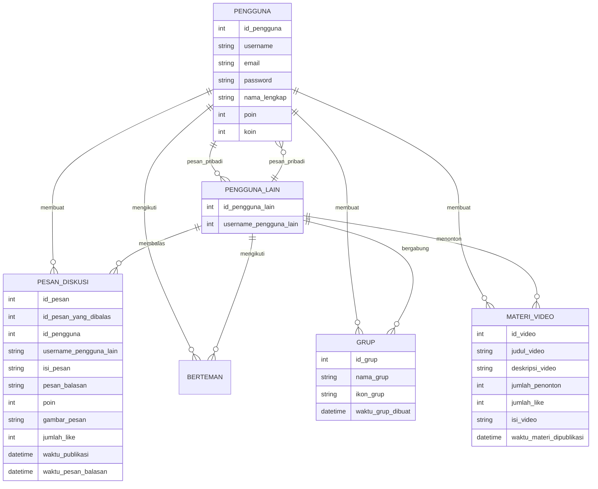
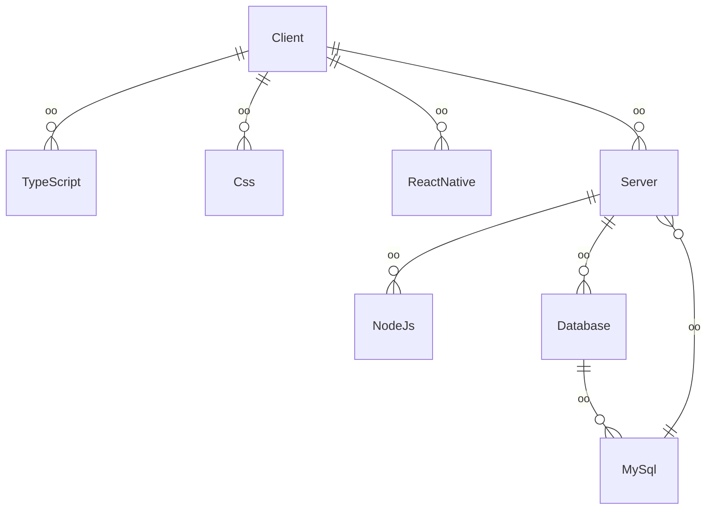

## 1.1 Latar Belakang

Membuat Aplikasi mobile legends

## 1.2. Deksripsi Teknologi Informasi

bla bla bla

## 1.3. Branding

bla bla bla

## 2. User Story

Pengguna bisa | Tingkat penting
---|---
Mengirim pesan diskusi | ⭐⭐⭐⭐⭐
---|---
Menonton video materi | ⭐⭐⭐⭐⭐
|
Mengikuti satu sama lain | ⭐⭐⭐⭐
|
Membalas pesan | ⭐⭐⭐⭐⭐
|
Mengirim pesan pribadi satu sama lain | ⭐⭐⭐⭐

## 3. Struktur Data

## 4. Arsitektur Sistem

## 5. Teknologi, Library, dan Framework

bla bla bla

## 6. Desain User Experience dan User Interface

## 7. Demonstrasi Video

Link youtube nya

## 8. Bagaimana mesin komputasi dan sistem operasi berperan dalam produk teknologi informasimu ?

Link youtube nya di detik jawaban ini

## 9. Bagaimana algoritma, struktur data, dan bahasa pemrograman berperan dalam produk teknologi informasimu ?

Link youtube nya di detik jawaban ini

## 10. Bagaimana metode pengembangan perangkat lunak / Software Development Life Cycle berperan dalam produk teknologi informasimu ?

Link youtube nya di detik jawaban ini

## 11. Bagaimana database / sistem basis data berperan dalam produk teknologi informasimu ?

Link youtube nya di detik jawaban ini
