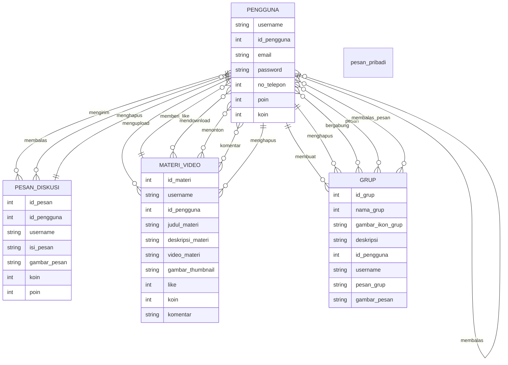
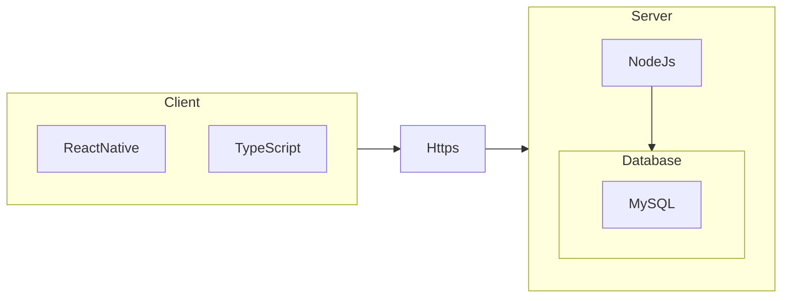

## 1.1 Latar Belakang

  Terkadang kita kesulitan menemukan materi koding yang kita inginkan atau ketika kita menenemukan materi namun dengan bahasa yang tidak kita pahami.

## 1.2. Deksripsi Teknologi Informasi
  ZapKode adalah aplikasi mobile berbasis client-server yang mengusung tema edukasi mengenai dunia IT, yang dimana IT sedang berkembang dengan sangat pesat. Berarti, kedepannya akan banyak lagi orang yang menekuni Teknologi Informasi. zapKode akan membantu kita untuk menjelajahi dunia IT, mulai dari bagaimana kita akan memulai, darimana kita akan memulai, dan apa saja yang akan kita pelajari.

## 1.3. Branding
   1. Branding :
    a. Merk        : ZAP CODE
    b. Tagline     : 
    c. Campaign    : 
  2. Target User : Anak muda indonesia yang memiliki semangat untuk selalu belajar
  3. User experience : 
    a. Berbahasa indonesia yang tidak rumit untuk dimengerti
    b. Bisa memperbagus portfolio dengan poin
    c. Bisa berbagi dan menambah ilmu

## 2. User Story

Sebagai | Ingin bisa | Sehingga | Prioritas
---|---|---|---
PENGGUNA | Menonton video materi dari saluran pengguna lain | video materi bisa ditonton pengguna lain | ⭐⭐⭐⭐⭐
PENGGUNA | Mengupload video materi shorts ODADING pada saluran diri sendiri | video ODADING bisa di upload | ⭐⭐⭐⭐⭐
PENGGUNA | Menyukai video materi dari saluran pengguna lain | video materi bisa disukai | ⭐⭐⭐
PENGGUNA | Membagikan video materi dari saluran lain | video materi bisa dibagikan | ⭐⭐⭐
PENGGUNA | Mengupload video materi untuk salurannya | video materi bisa diupload | ⭐⭐⭐⭐⭐
PENGGUNA | Memberikan harga berupa koin untuk setiap video materi dalam saluran sendiri | video materi bisa dihargai koin | ⭐⭐⭐⭐
PENGGUNA | Membeli video materi yang dihargai koin dari saluran pengguna lain | video materi bisa dibeli oleh koin | ⭐⭐⭐⭐⭐
PENGGUNA | Menambahkan deskripsi pada video materi disaluran sendiri | video materi bisa ditambah deskripsi | ⭐⭐⭐⭐
PENGGUNA | Mengedit deskripsi pada video materi disaluran sendiri | deskripsi video materi bisa diedit | ⭐⭐⭐⭐
PENGGUNA | Menghapus video materi disaluran sendiri | video materi bisa dihapus | ⭐⭐⭐⭐
PENGGUNA | Melaporkan setiap video materi yang tidak pantas atau di luar topik perkodingan | video materi bisa dilaporkan | ⭐⭐⭐⭐
PENGGUNA | Mengunduh video materi dari saluran lain | video materi bisa diunduh | ⭐⭐⭐⭐
PENGGUNA | Mengkategorikan atau membuat playlist untuk video materi di dalam salurannya atau dari saluran lain | video materi bisa di kategorikan | ⭐⭐⭐⭐
PENGGUNA | Mengupload pesan diskusi | pesan diskusi bisa diupload | ⭐⭐⭐⭐⭐
PENGGUNA | Membalas pesan diskusi pengguna lain | pesan diskusi bisa dibalas | ⭐⭐⭐⭐⭐
PENGGUNA | Menambahkan bobot pesan diskusi menggunakan koin yang dikonversi menjadi poin | pesan diskusi bisa memiliki bobot poin |⭐⭐⭐⭐⭐
PENGGUNA | Menyukai pesan diskusi pengguna lain | pesan diskusi bisa disukai | ⭐⭐⭐
PENGGUNA | Membagikan pesan diskusi pengguna lain | pesan diskusi bisa dibagikan | ⭐⭐⭐
PENGGUNA | Menambahkan gambar pada pesan diskusi | gambar bisa ditambahkan pada pesan diskusi |⭐⭐⭐⭐
PENGGUNA | Menghapus pesan diskusi | pesan diskusi bisa dihapus | ⭐⭐⭐⭐
PENGGUNA | Membuat grup komunitas | grup komunitas bisa dibuat| ⭐⭐⭐⭐⭐
PENGGUNA | Bergabung dalam grup komunitas | Pengguna bisa bergabung dalam grup komunitas |⭐⭐⭐⭐⭐
PENGGUNA | Mengupload gambar untuk foto profilnya | foto profil bisa ditambahkan |⭐⭐⭐⭐
PENGGUNA | Membuat pesan pribadi pada pengguna lain | pesan pribadi bisa dibuat | ⭐⭐⭐⭐⭐
PENGGUNA | Membalas pesan pribadi dari pengguna lain | pesan pribadi bisa dibalas | ⭐⭐⭐⭐
PENGGUNA | Melakukan pencarian video materi | video materi bisa di cari di pencarian | ⭐⭐⭐⭐⭐
PENGGUNA | Melakukan pencarian topik pesan diskusi | topik pesan diskusi bisa dicari |⭐⭐⭐⭐⭐

## 3. Struktur Data

## 4. Arsitektur Sistem

## 5. Teknologi, Library, dan Framework
  1. ReactNative
  2. JavaScript
  3. TypeScript
  4. NodeJs (Server)
  5. MySql (DBMS)
  6. Windows (OS)
  7. Android Studio
  8. VS Code
## 6. Desain User Experience dan User Interface

## 7. Demonstrasi Video

Link youtube nya

## 8. Bagaimana mesin komputasi dan sistem operasi berperan dalam produk teknologi informasimu ?

Link youtube nya di detik jawaban ini

## 9. Bagaimana algoritma, struktur data, dan bahasa pemrograman berperan dalam produk teknologi informasimu ?

Link youtube nya di detik jawaban ini

## 10. Bagaimana metode pengembangan perangkat lunak / Software Development Life Cycle berperan dalam produk teknologi informasimu ?

Link youtube nya di detik jawaban ini

## 11. Bagaimana database / sistem basis data berperan dalam produk teknologi informasimu ?

Link youtube nya di detik jawaban ini
